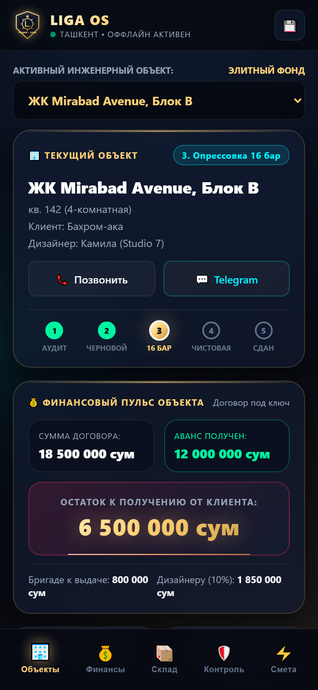
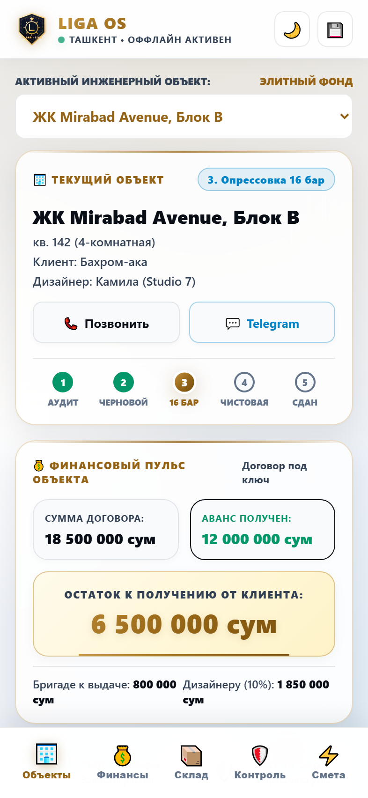

# 🛡️ LIGA OS — Операционная Система Инженерного Мастера
> Автономная мобильная операционная система и цифровой верстак для ведущего инженера сантехники элитного жилья в Ташкенте (Мастер Улугбек Хакимов, «Лига Опытных Мастеров»).

| Тёмный стиль (Dark Titanium) | Светлый стиль (Light Ceramic White Gold) |
| :---: | :---: |
|  |  |

---

## 🌓 Две премиальные дизайн-темы (Мгновенное переключение ☀️ / 🌙)

1. **Dark Titanium & Gold Glassmorphism**:
   - Фон: глубокий матовый титан (`#060911`, `#0a1120`).
   - Карточки: затемненное полупрозрачное стекло с размытием (`backdrop-filter: blur(24px)`).
   - Золотой статус: полированное золото (`#ffd175`, `#d4a359`).
   - Неоновые индикаторы: опрессовка 16 бар (`#00f2fe`), аванс (`#00f5a0`), остаток долга (`#ff2a5f`).

2. **Light Ceramic & White Gold Glassmorphism**:
   - Фон: светлая платиновая керамика (`#f2f5fa`).
   - Карточки: белоснежное матовое стекло (`rgba(255, 255, 255, 0.86)` с `backdrop-filter: blur(28px)`).
   - Золотой статус: глубокое королевское золото (`#946316`, `#b8832a`).
   - Высококонтрастная типографика: глубокий угольный графит (`#090e17`) для кристальной читаемости на ярком солнце на стройках.

---

## 🌟 Ключевые возможности

1. **Реестр элитных объектов (Site Cards)**:
   - Быстрое переключение между объектами (ЖК Mirabad Avenue, Nest One, частные резиденции).
   - Связь с заказчиком и дизайнером в 1 клик (Звонок / Telegram).
   - Степпер 5 этапов монтажа: `[1. Аудит] ➔ [2. Черновой монтаж] ➔ [3. Опрессовка 16 бар] ➔ [4. Чистовая] ➔ [5. Сдан]`.

2. **Карманный финансовый директор (Cashflow)**:
   - Фиксация договора, авансов и мгновенный расчет остатка долга клиента золотым шрифтом.
   - Учет расчетов с бригадой (Алишер, Сардор) и партнерских 10% дизайнеру.

3. **Флагманский генератор Исполнительного Инженерного Паспорта (PDF Engine)**:
   - Встроенный клиентский генератор официального документа формата А4.
   - Золотой геральдический герб Лиги Мастеров.
   - Официальный протокол гидравлических испытаний (Опрессовка 16 бар, тест х4, 24 часа без падения давления).
   - Юридическое предупреждение для отделочников и мебельщиков о запрете сверления без сверки со схемой.
   - Двухуровневая модель гарантии (10–50 лет на Rehau/FAR + договор на монтаж).

4. **Экспресс-калькулятор сметы за 60 секунд**:
   - Крупные кнопки-счетчики санузлов, водорозеток, инсталляций Geberit, iBox, трапов и теплого пола.
   - Мгновенный расчет вилки стоимости в сумах и долларах ($).
   - Кнопка формирования готового сообщения для отправки в Telegram.

5. **100% Offline-First автономность**:
   - База данных **IndexedDB** прямо в памяти смартфона.
   - Service Worker кэширует всё приложение (Cache First) — работает в монолитных новостройках и подвалах без сети.
   - Кнопка резервного копирования базы данных в 1 файл JSON для отправки в Telegram.

---

## 🚀 Деплой на Vercel
Приложение полностью статическое (HTML5/CSS3/JS PWA), не требует сборки и готово к мгновенному развертыванию на Vercel.
- Репозиторий GitHub: **https://github.com/said-77/LIGA-OS**
