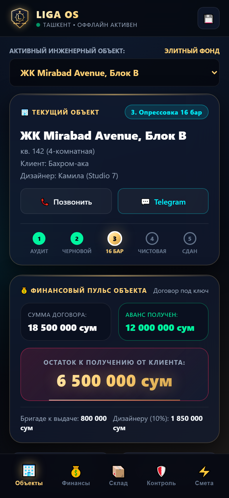
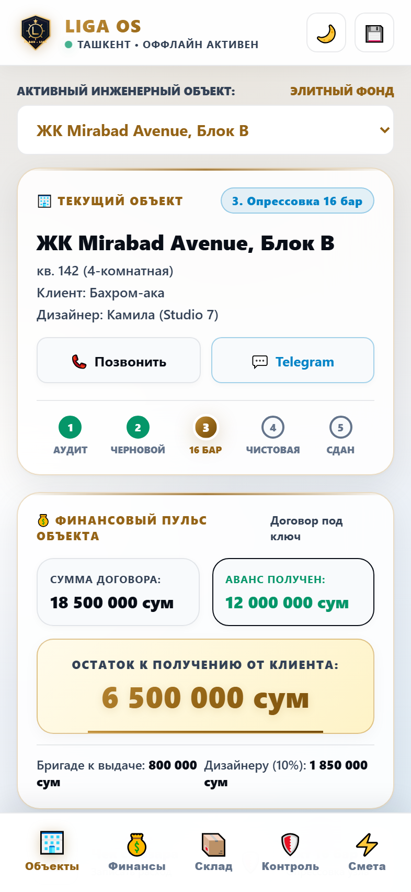

# 🛡️ LIGA OS — Операционная Система Инженерного Мастера
> Автономная мобильная операционная система и цифровой верстак для ведущего инженера сантехники элитного жилья в Ташкенте (Мастер Улугбек Хакимов, «Лига Опытных Мастеров»).

| Тёмный стиль (Dark Titanium) | Светлый стиль (Light Ceramic White Gold) |
| :---: | :---: |
|  |  |

---

## 🌓 Две премиальные дизайн-темы (Мгновенное переключение ☀️ / 🌙)

1. **Dark Titanium & Gold Glassmorphism**:
   - Фон: глубокий матовый титан (`#060911`, `#0a1120`).
   - Карточки: затемненное полупрозрачное стекло с размытием (`backdrop-filter: blur(24px)`).
   - Золотой статус: полированное золото (`#ffd175`, `#d4a359`).
   - Неоновые индикаторы: опрессовка 16 бар (`#00f2fe`), аванс (`#00f5a0`), остаток долга (`#ff2a5f`).

2. **Light Ceramic & White Gold Glassmorphism**:
   - Фон: светлая платиновая керамика (`#f2f5fa`).
   - Карточки: белоснежное матовое стекло (`rgba(255, 255, 255, 0.86)` с `backdrop-filter: blur(28px)`).
   - Золотой статус: глубокое королевское золото (`#946316`, `#b8832a`).
   - Высококонтрастная типографика: глубокий угольный графит (`#090e17`) для кристальной читаемости на ярком солнце на стройках.

---

## 🌟 Ключевые возможности LIGA OS (Версия 2.3.6)

### 1. Реестр элитных объектов и статус-компас (Site Cards & Compass)
- Быстрое переключение между объектами (ЖК Mirabad Avenue, Infinity, Nest One, частные резиденции).
- **Навигационный статус-компас в шапке** (`#header-screen-ribbon`): мгновенная индикация активного раздела и контекста объекта.
- Связь с заказчиком и дизайнером в 1 клик (Звонок / Telegram).
- Степпер 5 этапов монтажа: `[1. Аудит] ➔ [2. Черновой монтаж] ➔ [3. Опрессовка 16 бар] ➔ [4. Чистовая] ➔ [5. Сдан]`.
- Инженерная карта допуска **Quality Gate** перед заливкой стяжки.
- **3D-хронометр готовности** Chrono-Radar и карточка «👉 Следующий ключевой шаг мастера».

### 2. Швейцарский пульт инженера («⋯ Меню»)
- Доступен из любой точки системы в 1 клик (свайп-шторка Dark Titanium).
- 3 структурированные категории:
  - 🧮 **Инженерные калькуляторы котельной и сантехники**;
  - 🛡️ **Контроль надежности и диалоги** (Экспресс-аудит, Памятка мастера, Режим клиента, Подсказка новичка);
  - ⚙️ **Система, голос и приватность** (LIGA AI, Диктовка, Темы, Резервная копия, Звуки, Настройки).

### 3. Инженерно-расчетный комплекс котельной и сантехники (8 калькуляторов)
1. **Гидравлический разделитель (гидрострелка)**: согласование котла и контуров, правило $3d/3v$, предельная скорость $v_0 \le 0.15$ м/с, автоподбор моделей «Север/Termojet» и защитной арматуры Caleffi.
2. **Мембранный расширительный бак Reflex и сбросной клапан DIN EN 12828**: расчет емкости системы $V_s$, теплового расширения $V_e$, статики $P_{st}$, давления накачки азота $P_0$, подбор бака Reflex N, сервисного крана Reflex SU 3/4" и клапана Caleffi 3.0 бар.
3. **Циркуляционные насосы Grundfos / Wilo и магистрали Rehau**: расчет рабочей точки ($Q, H$), потерь по Дарси-Вейсбаха, подбор диаметров труб Rehau по скорости $0.3 \le v \le 0.7$ м/с.
4. **Гидравлическая балансировка ротаметров FAR / Caleffi**: увязка петель теплого пола, расчет точных расходов (0.5–5.0 л/мин) и авторитета клапанов.
5. **Водяной теплый пол и смесительный узел (НСУ)**: раскладка петель с шагом 150 мм ($\le 75-80$ м на контур), расчет бухт по 200 м и подбор коллекторов FAR.
6. **Лучевая радиаторная сеть**: расчет биметаллических и панельных радиаторов, узлов нижнего подключения и труб Rehau Stabil.
7. **Бойлер косвенного нагрева (БКН) и бак ГВС**: расчет объема бойлера на семью, бака Reflex Refix DE и циркуляции ГВС.
8. **Защита от протечек Neptun Smart / Gidrolock**: расчет электрокранов Bugatti 12V, радиодатчиков 868 МГц, резервного питания LiFePO4 и американок FAR.

### 4. Гибкие стандарты опрессовки под реалии Ташкента
- Пресеты: **16.0 бар** (Швейцарский эталон Лиги, запас 4.6x), **10.0 бар** (Rehau, запас 2.9x), **6.0 бар** (СНиП, запас 1.7x), **4.0 бара** (сеть водопровода Ташкента 3.5 бар, запас 1.15x) и свободный ввод **1.5–40 бар**.
- Динамические бланки документов: `АКТ-16Б-*` при $\ge 15$ бар и `АКТ-ОПР-*` при $< 15$ бар.
- Золотое клеймо Лиги Опытных Мастеров `16 BAR` с сохранением юридической силы.

### 5. Флагманский генератор Исполнительного Инженерного Паспорта А4 (PDF Engine)
- Встроенный клиентский генератор официального документа формата А4 без сервера.
- Золотой геральдический герб Лиги Мастеров.
- Фотофиксация манометра и скрытых трасс Rehau Pink до заливки пола.
- Юридическое предупреждение для отделочников о запрете сверления пола без схемы.
- Двухуровневая модель гарантии (10–50 лет на заводские узлы + гарантия на монтаж).

### 6. Карманный снабженец базаров Джами и Урикзар
- Голосовой ввод понимает естественную речь базара: *«купил на Джами 3 крана FAR за 450 тысяч»*, *«выдал Алишеру аванс 300 тысяч»*, *«клиент перевел 2 миллиона»*.
- Экспресс-конвертер валюты: доллары $\leftrightarrow$ сумы по расчетному курсу мастера.
- Формирование готовых базарных записок для продавцов в Telegram в 1 тап.

### 7. 100% Offline-First автономность и конфиденциальность
- База данных **IndexedDB v2** (8 изолированных хранилищ) прямо в памяти смартфона.
- Service Worker кэширует ядро приложения — 100% работоспособность в подвалах и монолитных новостройках без связи.
- **Режим показа клиенту (Client View)**: надежное сокрытие зарплатных долгов бригаде, оптовых цен базара и личных заметок мастера.
- Локальное резервное копирование базы в 1 JSON-файл через нативный системный диалог `navigator.share()`.

---

## 🧪 Надежность и автоматизированное тестирование
Система защищена от сбоев и регрессий сквозным сьютом автоматических тестов Playwright:
* **58 сквозных автотестов** покрывают каждый сценарий мастера;
* **100% успешное прохождение (58 passed, 0 failed)**;
* Изоляция тестов по независимым сетевым портам.

---

## 🚀 Деплой на Vercel
Приложение полностью статическое (HTML5/CSS3/Vanilla JS PWA), не требует сборки и готово к мгновенному развертыванию на Vercel или любом статическом хостинге.
- Репозиторий GitHub: **https://github.com/said-77/LIGA-OS**
